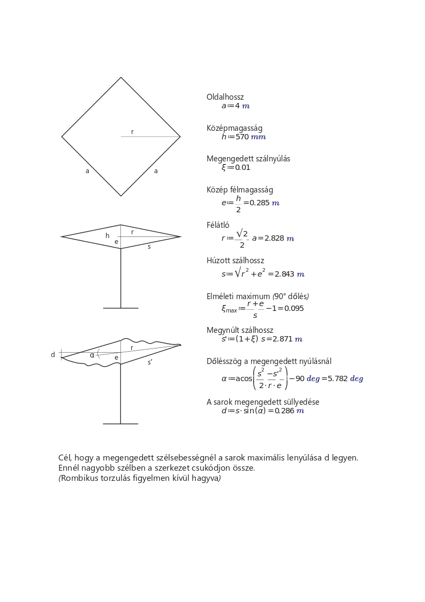

# Atum

Az alább részleteztt tecnológiai fejlesztést létrehozó nyílt szoftverek és bemutató-oldal generátorának megosztására jött létre ez a felület. A technológia bemutatása alább olvasható.

[Bemutató oldal](https://atum-shade.github.io/)

## Árnyékoló technológia

Az ismert megoldások fényében felmerült az igény olyan árnyékoló szerkezetre, amely tetszőleges alakú ernyőfelülettel megvalósítható, könnyen nyitható és csukható kialakítással és egyszerű felépítéssel rendelkezik, és a hagyományos megoldásokhoz képest kevésbé hajlamos meghibásodásra. 
A találmány szerinti megoldás elsődleges célja olyan árnyékoló szerkezet kidolgozása, amely tetszőleges alakú ernyőfelülettel, például kör alakú vagy térbeli ernyőfelülettel megvalósítható, az árnyékoló szerkezet kompakt elrendezésű csukott állapottal rendelkezik, és csukott állapotban az ernyőfelület egyszerűen és kíméletesen fel van tekerve.

A találmány további célja olyan árnyékoló szerkezet megalkotása, amely könnyen nyitható és csukható kialakítással rendelkezik, és az ernyőfelület feltekerése összecsukáskor, valamint nyitáskor való kitekerése kíméletesen, az ernyőfelület anyagának sérülési esélyét csökkentve van megvalósítva.

A találmány célja még olyan árnyékoló szerkezetek kialakítása, amelyek nyitott állapotban egymás mellett, ernyőfelületükkel egymáshoz illeszkedően elrendezhetők olyan módon, hogy az egymással szomszédos árnyékoló szerkezetek egymástól függetlenül nyithatók és csukhatók, egymás nyitását és csukását nem akadályozzák.

A találmány célja még olyan árnyékoló szerkezet kialakítása, amely leegyszerűsíti komplex felületű ernyők tervezését egyszerű szegmensek sorolásával.

A találmány szerinti árnyékoló szerkezet előnye, hogy tetszőleges alakú ernyőfelülettel kialakítható, azaz az ernyőfelület alakja nincsen lekorlátozva sokszög alakokra; a találmány szerinti árnyékoló szerkezet kör alakú ernyőfelülettel is megvalósítható. 

A találmány szerinti árnyékoló szerkezet további előnye, hogy az egyszerű szerkezeti felépítésnek köszönhetően a hagyományos esernyő vagy napernyő megoldásokhoz képest kevésbé hajlamos a meghibásodásra, valamint külső hatásoknak, például szél hatásának is jobban ellenáll, illetve szél hatására a szerkezet kevésbé sérülékeny. 

További előnyt jelent, hogy a találmány szerinti árnyékoló szerkezet egyes előnyös kiviteli alakjaiban az ernyőfelület kíméletesen, gyűrődésmentesen feltekerhető. Felismertük, hogy az ernyőfelület az ismert megoldásokhoz képest kíméletesebben, azaz az ernyőfelület gyűrődése, és emiatti sérülése, kopása nélkül fel lehet tekerni, amennyiben a feltekerés közben az ernyőfelület folyamatosan ki van feszítve.  Laza, ki nem feszített felületek feltekerésénél szinte biztosan tekerünk egymásra gyűrődéseket, ami az ernyőfelület anyagának kopásával, sérülésével, azaz az árnyékoló szerkezet élettartamának rövidülésével jár. 

Azt is felismertük, hogy a találmány szerinti árnyékoló szerkezettel az ernyőfelület feltekerése és az árnyékoló szerkezet összecsukása egyszerre is megvalósítható, lényegében az ernyőfelület feltekerése okozza az árnyékoló szerkezet összecsukását, ami az árnyékoló szerkezet egyszerűbb és gyorsabb alkalmazását teszi lehetővé.

A találmány egyes előnyös kiviteli alakjainak további előnye, hogy az árnyékoló szerkezet külső erőhatásra, például nagy szélben, képes az árnyékoló szerkezet összecsukására az ernyőfelület feltekerésével, ami megvédi az árnyékoló szerkezetet az esetleges sérülésektől.

## Szélnyomásból következő szövetnyúlás limitének becslése

## Kapcsolat
[minusplus.hu](http://www.minusplus.hu/)
